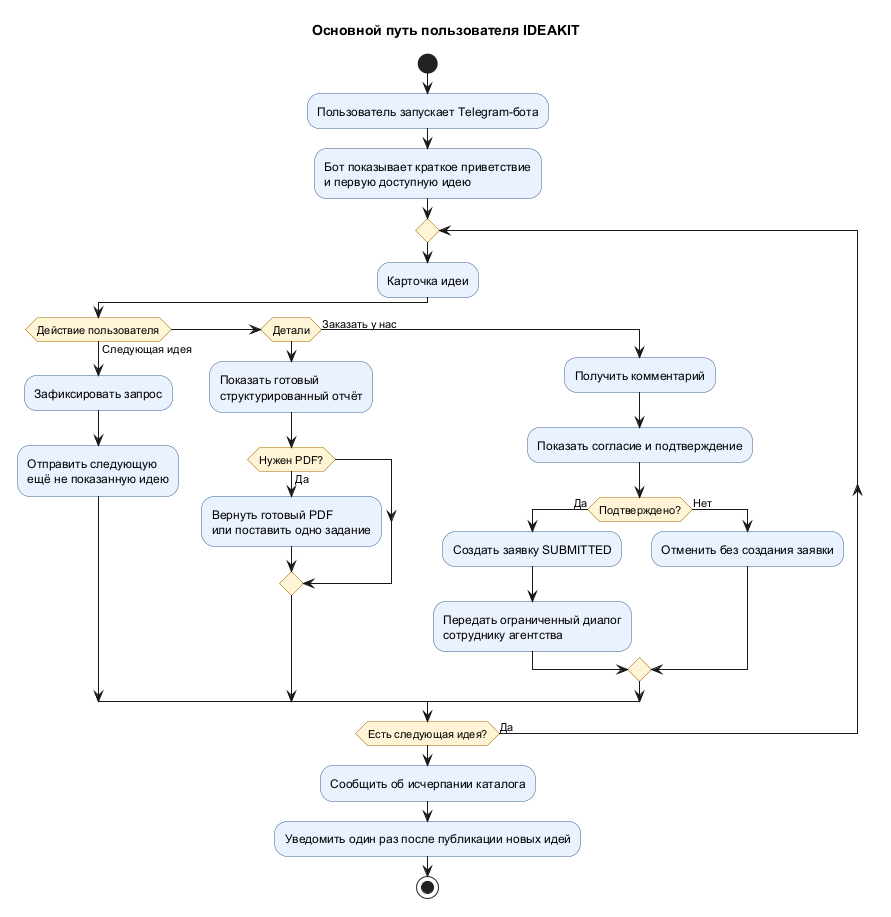

# MVP IDEAKIT

> **Статус:** утверждённые продуктовые требования к MVP. Документ описывает целевое поведение, а не текущее состояние реализации.

## 1. Назначение продукта

IDEAKIT — бесплатный Telegram-сервис для последовательного просмотра подготовленных цифровых бизнес-идей. Он помогает начинающему предпринимателю перейти от абстрактного интереса к структурированному плану запуска и, при необходимости, отправить заявку цифровому агентству на реализацию выбранной идеи.

Основной пользовательский интерфейс — Telegram-бот. Отдельный пользовательский веб-интерфейс, мобильное приложение и обязательный Telegram Mini App в MVP отсутствуют.

## 2. Проблема пользователя

Пользователь:

- не может быстро найти подходящую бизнес-идею;
- не понимает, насколько идея реалистична и кому она нужна;
- не знает, как превратить идею в конкретный MVP и план первых действий;
- не имеет быстрого пути к команде, способной реализовать цифровую часть проекта.

## 3. Целевая аудитория

- начинающие предприниматели;
- русский язык;
- основной регион — РФ и страны СНГ;
- пользователь Telegram;
- на старте не требуется анкета, выбор категорий или персонализация.

## 4. Ценность

Основная ценность продукта — быстрый путь:

```text
идея → проверенный подробный анализ → план MVP → первые шаги → заявка на реализацию
```

Пользователь возвращается в сервис, потому что:

- идеи выдаются по одной и не повторяются;
- каталог регулярно пополняется;
- каждая опубликованная идея уже имеет готовый подробный отчёт;
- просмотр не требует регистрации вне Telegram и заполнения анкеты;
- при реальном интересе не нужно отдельно искать исполнителя.

В отличие от Telegram-канала, IDEAKIT хранит персональную историю показов, выдаёт следующую ещё не просмотренную идею, предоставляет структурированный отчёт и связывает выбранную идею с конкретной заявкой агентству.

## 5. Основной путь пользователя



Исходник диаграммы: [`mvp-user-journey.puml`](../.diagrams/mvp-user-journey.puml).

## 6. Карточка идеи

Бот показывает одну карточку объёмом от 500 до 1000 знаков. В карточке присутствуют:

- название;
- проблема или потребность;
- целевая аудитория;
- способ монетизации.

Доступные действия:

- **«Следующая идея»** — показать следующую доступную идею;
- **«Детали»** — открыть готовый подробный отчёт;
- **«Заказать у нас»** — начать создание заявки агентству.

После перехода к следующей идее старая карточка остаётся в истории Telegram. Кнопка «Следующая идея» у неё становится недоступна, а «Детали» и «Заказать у нас» сохраняются, пока идея опубликована.

## 7. Подробный отчёт

Каждая опубликованная идея имеет готовый структурированный отчёт:

1. проблема и целевая аудитория;
2. бизнес-модель и монетизация;
3. рынок и конкуренты;
4. риски и предположения;
5. пошаговый план MVP;
6. первые действия на 30 дней.

Отчёт формируется заранее, показывается в Telegram и при необходимости детерминированно разбивается на несколько сообщений. PDF создаётся при первом запросе, привязывается к конкретной редакции идеи и повторно используется.

URL источников не показываются пользователю ни в Telegram, ни в PDF. Источники, снимки и доказательства значимых утверждений хранятся внутри системы.

## 8. Каталог

- перед запуском подготовлено не менее 50 опубликованных идей;
- ориентир пополнения — до 10 прошедших проверку идей в неделю;
- все пользователи идут по общей неизменяемой последовательности;
- опубликованной редакции присваивается неизменяемый возрастающий `sequence_no`;
- перестановка уже опубликованных идей запрещена;
- ранее показанная редакция автоматически не выдаётся повторно;
- существенно обновлённая редакция может быть повторно опубликована для прежних пользователей только по явному решению администратора;
- допускаются ИТ- и другие цифровые идеи, существенную часть MVP которых способно реализовать агентство.

Если пользователь просмотрел все доступные идеи, бот сообщает об исчерпании каталога. После публикации новых идей пользователь получает одно уведомление и продолжает последовательность.

## 9. Подготовка контента

Контент не генерируется во время пользовательского запроса. Фоновый PHP-модуль поддерживает готовый пул идей и отчётов.

Публикация выполняется автоматически только после успешного прохождения обязательных проверок:

- корректность структуры;
- соответствие цифровому направлению;
- отсутствие недопустимого дубликата;
- наличие и актуальность источников;
- подтверждение фактов и точных рыночных чисел;
- итоговая проверка качества.

Результаты `FAIL`, `ERROR` и `UNKNOWN` обязательной проверки запрещают публикацию и переводят материал в `REVIEW_REQUIRED`. Ручной обход блокирующих проверок отсутствует.

## 10. Заявка агентству

Пользователь:

1. нажимает «Заказать у нас»;
2. вводит свободный комментарий;
3. видит текст согласия и подтверждает отправку;
4. получает сообщение «Заявка принята».

До подтверждения пользователь может отменить действие без создания заявки. После подтверждения заявка получает статус `SUBMITTED`. Отзыв доступен только до начала обработки агентством.

Агентство отвечает через административный портал, а бот доставляет сообщение пользователю. Пользователь отвечает внутри конкретной заявки. Это ограниченная переписка по лиду, а не общий чат поддержки.

Активная заявка по той же редакции идеи не дублируется. Новая заявка разрешается после `UNQUALIFIED`, `CLOSED` или `CANCELLED`. Формальный SLA ответа в MVP отсутствует.

## 11. Информационный сервис и агентская воронка

Информационный сервис заканчивается на бесплатном просмотре карточки, подробного отчёта и PDF.

Агентская воронка начинается только после явного действия «Заказать у нас», ввода комментария и отдельного подтверждения согласия. Просмотр идеи или деталей сам по себе не создаёт заявку и не передаёт контакт агентству как лид.

## 12. Административные возможности

MVP предусматривает административный веб-интерфейс для:

- управления идеями, редакциями, отчётами и публикациями;
- просмотра источников и проверок качества;
- ручного запуска или повторного запуска фонового задания;
- обработки заявок и переписки;
- просмотра пользователей и базовой агрегированной аналитики;
- управления администраторами и ролями.

Роли:

- `SUPER_ADMIN` — полный доступ, роли и настройки;
- `CONTENT_MANAGER` — контент, источники, проверки и фоновые задания;
- `AGENCY_OPERATOR` — заявки, статусы и переписка;
- `VIEWER` — чтение каталога и агрегированной аналитики без доступа к переписке.

## 13. Критерии успеха

Основные показатели:

- количество активных пользователей;
- количество квалифицированных заявок.

Активный пользователь за 30 дней:

- просмотрел не менее трёх идей;
- и открыл детали либо подтвердил заявку.

Квалифицированная заявка — уникальная заявка, для которой агентство подтвердило реальный интерес и возможность продолжить контакт. Числовые цели устанавливаются после пилота.

## 14. Входит в MVP

- Telegram-идентификация пользователя;
- последовательная выдача одной идеи за раз;
- защита от повторного показа;
- готовый каталог и фоновое пополнение;
- карточка, подробный отчёт и PDF;
- история показов и действий;
- уведомление о новых идеях;
- создание, отзыв, квалификация и переписка по заявке;
- административный портал;
- хранение источников и доказательств;
- базовая аналитика;
- асинхронные операции и наблюдаемые ошибки.

## 15. Приёмка MVP

MVP готов к запуску, если одновременно выполнены условия:

1. опубликованы не менее 50 идей с готовыми отчётами и пройденными обязательными проверками;
2. `/start`, следующая идея, детали, PDF и заявка работают сквозным сценарием;
3. повторное обновление Telegram, нажатие кнопки, фоновое задание или подтверждение заявки не создаёт повторный эффект;
4. просмотренная редакция не выдаётся повторно без явного разрешения;
5. недоступность провайдера ИИ не мешает просмотру готового каталога и работе с заявками;
6. URL источников отсутствуют в Telegram и PDF;
7. персональные данные пользователей и заявок не передаются провайдерам ИИ и поиска;
8. роли, TOTP, причины критических действий и аудит работают;
9. восстановление PostgreSQL и обработка отказов RabbitMQ проверены.
