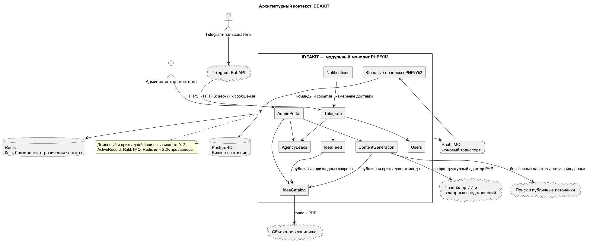
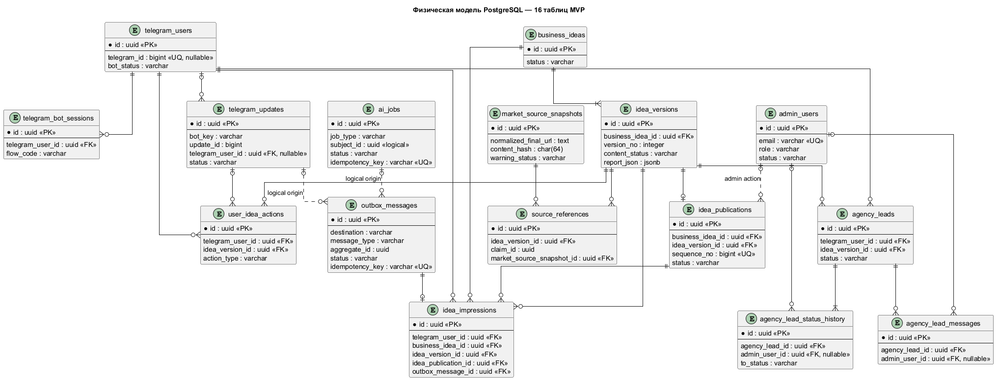

# Техническая спецификация IDEAKIT

> **Статус:** утверждённая проектная спецификация MVP.
>
> **Важно:** документ описывает целевую архитектуру. Реализованные и запланированные элементы явно разделены в разделе 2.

## 1. Назначение

Документ определяет технические границы MVP IDEAKIT:

- архитектуру модульного приложения PHP/Yii2;
- модули и владельцев данных;
- технологический стек;
- внешние и внутренние контракты;
- обработку обновлений Telegram и фоновых операций;
- состав и ключевые инварианты PostgreSQL;
- требования к безопасности, надёжности и тестированию;
- рекомендуемый порядок начала разработки.

Связанные документы:

- [`mvp.md`](./mvp.md) — цели, границы и критерии готовности MVP;
- [`user-flows.md`](./user-flows.md) — пользовательские и административные сценарии;
- [`code-style.md`](./code-style.md) — обязательный стиль PHP-кода.

## 2. Состояние реализации и целевой стек

### 2.1. Подтверждено репозиторием

На текущем этапе в репозитории присутствует базовый каркас Yii2:

- ограничение PHP — версия 8.1 или выше;
- Yii2 2.0.55 зафиксирован в `composer.lock`;
- настроен PHP CS Fixer на основе PSR-12;
- настроен PHPStan с существующим уровнем 6;
- присутствуют зависимости Codeception;
- продуктовые модули, миграции PostgreSQL и полная инфраструктура MVP ещё не реализованы.

Фактические версии всегда определяются исполняемыми источниками: `composer.json`, `composer.lock`, образами контейнеров и конфигурацией CI.

### 2.2. Целевая конфигурация MVP

| Область | Решение | Правило фиксации |
|---|---|---|
| Язык | PHP; нижняя граница пока 8.1 | изменение версии выполняется отдельной задачей после проверки совместимости |
| Веб-фреймворк | Yii 2.0 | точная версия из `composer.lock` |
| Основная БД | PostgreSQL | стабильная версия фиксируется образом или управляемым сервисом |
| Кэш и блокировки | Redis | только производное и восстанавливаемое состояние |
| Фоновые сообщения | RabbitMQ | доставка не менее одного раза через транзакционный исходящий журнал |
| Веб-процессы | Nginx + PHP-FPM | отдельное масштабирование от фоновых процессов |
| Фоновые процессы | консольное приложение Yii2 | тот же код и тот же выпуск, что у веб-приложения |
| PDF | Dompdf с встроенным кириллическим шрифтом | зависимость фиксируется Composer |
| Файлы | S3-совместимое объектное хранилище | конкретный провайдер выбирается отдельно |
| Административный интерфейс | серверные представления Yii2 | без отдельного SPA в MVP |
| CI/CD | GitHub Actions | проверки добавляются по мере появления соответствующей инфраструктуры |
| Наблюдаемость | структурированные JSON-логи, Sentry и внешний монитор доступности | без собственного комплекса Prometheus/Grafana/Loki в MVP |

Используются только стабильные версии без предварительных выпусков. Обновление зависимости не выполняется попутно с продуктовой задачей.

## 3. Архитектура

MVP представляет собой одно приложение PHP/Yii2 с модульной внутренней архитектурой. Веб- и фоновые процессы используют общий код и выпускаются одной версией, но запускаются и масштабируются независимо.

Отдельные сервисы Python/FastAPI, отдельный сервис Telegram, отдельные бизнес-базы данных и сетевые вызовы между внутренними модулями в MVP отсутствуют.



Исходник диаграммы: [`system-context.puml`](../.diagrams/system-context.puml).

### 3.1. Источники истины

- PostgreSQL — единственное авторитетное хранилище бизнес-состояния.
- Redis — производный кэш, краткоживущие блокировки и ограничения частоты запросов.
- RabbitMQ — транспорт фоновых команд и событий, но не источник их результата.
- Объектное хранилище содержит регенерируемые PDF.
- Telegram и внешние провайдеры не владеют внутренними бизнес-статусами.

### 3.2. Подготовка к возможному выделению модулей

Модуль выделяется в отдельный PHP-сервис только при измеримой необходимости независимого масштабирования, выпуска или изоляции отказов.

До выделения должны быть определены:

1. публичный типизированный контракт прикладного слоя;
2. совместимые контрактные фикстуры;
3. единственный владелец данных;
4. версионированные сообщения для асинхронного взаимодействия;
5. миграционный процесс и сверка перенесённых данных.

Внутри монолита сетевой транспорт не имитируется.

## 4. Модули и владельцы

| Модуль | Тип | Ответственность |
|---|---|---|
| `Users` | бизнес-модуль | пользователи Telegram, сессии, доступность бота, обезличивание, администраторы и MFA |
| `IdeaCatalog` | бизнес-модуль | идеи, редакции, публикации, отчёты, источники и доказательства |
| `IdeaFeed` | бизнес-модуль | последовательная выдача, показы, действия и исчерпание каталога |
| `ContentGeneration` | бизнес-модуль | задания ИИ, промпты, провайдеры, поиск, получение источников, дедупликация и проверка качества |
| `AgencyLeads` | бизнес-модуль | заявки, конечный автомат статусов, история и переписка |
| `Notifications` | бизнес-модуль | намерения уведомлений, устранение дублей, подавление и проверка получателя |
| `Telegram` | модуль доставки | вебхук, кнопки и отображение сообщений Telegram; владеет только техническим входящим контуром |
| `AdminPortal` | модуль доставки | веб-представление прикладных команд и запросов; не владеет бизнес-данными |
| `Platform` | технический контур | таблица `outbox_messages`, доставка в RabbitMQ и общие механизмы аренды и сверки операций |

У каждой таблицы, очереди, фонового обработчика, пространства ключей Redis и внешнего эффекта ровно один владелец.

Модуль не обращается напрямую к внутренним классам, ActiveRecord, репозиториям или таблицам другого модуля.

## 5. Слои и зависимости

Структура создаётся внутри модуля только при появлении реального кода:

```text
Module/
├── Domain/
├── Application/
├── Infrastructure/
└── Presentation/
```

### 5.1. Доменный слой (`Domain`)

- зависит только от PHP и собственных абстракций;
- содержит бизнес-инварианты, сущности, объекты-значения, агрегаты и доменные события;
- не использует Yii2, ActiveRecord, SQL, Redis, RabbitMQ, HTTP или SDK провайдера;
- не содержит изменяемых опубликованных редакций, отчётов и доказательств источников.

### 5.2. Прикладной слой (`Application`)

- реализует пользовательские цели через отдельные команды и запросы;
- управляет авторизацией, транзакционной границей и вызовом портов;
- принимает и возвращает неизменяемые типизированные DTO;
- не возвращает ActiveRecord, HTTP-ответ или объект внешнего провайдера.

### 5.3. Инфраструктурный слой (`Infrastructure`)

- реализует хранение PostgreSQL, отображение ActiveRecord, Redis, RabbitMQ, Telegram, ИИ, поиск, получение страниц, PDF и объектное хранилище;
- преобразует внешние данные в безопасные внутренние типы;
- не принимает бизнес-решения.

### 5.4. Слой представления (`Presentation`)

- проверяет входные транспортные данные;
- вызывает одну прикладную команду или запрос;
- формирует Telegram-, HTML- или JSON-ответ;
- не содержит переходов бизнес-состояний и прямых записей в таблицы.

## 6. DDD и CQRS

- Команда выражает одно намерение изменить состояние и имеет один обработчик.
- Запрос не изменяет бизнес-состояние и возвращает типизированную проекцию.
- Команда не вызывает обработчик запроса для проверки инварианта записи.
- Команда возвращает узкую квитанцию: идентификатор, результат принятия или новую версию.
- ActiveRecord используется только как инфраструктурная модель хранения.
- Агрегат создаётся только для реальной границы согласованности.
- Доменное событие описывает завершённый факт внутри одного модуля.
- Интеграционное событие публикуется после фиксации транзакции через `outbox_messages`.
- CQRS не означает хранение состояния через события, отдельную БД чтения или обязательную согласованность с задержкой.

## 7. Основные технические потоки

### 7.1. Приём обновления Telegram

1. Публичный вебхук принимает обновление Telegram.
2. Слой представления проверяет секретный заголовок, размер, структуру и допустимый тип.
3. Одна транзакция сохраняет `telegram_updates` и исходящее намерение в `outbox_messages`.
4. После фиксации транзакции Telegram получает `200 OK`.
5. Фоновый обработчик выполняет прикладную команду идемпотентно.

Повторный `(bot_key, update_id)` возвращает ранее принятый результат и не создаёт новый бизнес-эффект.

### 7.2. Получение следующей идеи

1. Под блокировкой пользователя проверяется незавершённая доставка карточки.
2. Выбирается публикация с минимальным доступным `sequence_no`.
3. Создаются действие `NEXT_REQUESTED` и одно исходящее сообщение карточки.
4. Внешний вызов Telegram выполняется без открытой транзакции БД.
5. `idea_impressions` создаётся только после подтверждённой доставки или действия с реально полученной карточкой.

Неоднозначный результат Telegram получает состояние `UNKNOWN` и не повторяется вслепую.

### 7.3. Детали и PDF

- Пользователь сразу получает заранее подготовленный структурированный отчёт.
- Длинный отчёт детерминированно разделяется по секциям.
- PDF создаётся один раз для конкретной `IdeaVersion` и повторно используется.
- Одновременные запросы не создают несколько файлов.
- URL источников не включаются в Telegram-сообщения и PDF.

### 7.4. Заявка агентству

1. Комментарий временно сохраняется в сессии диалога.
2. Пользователь видит итоговый текст и подтверждает согласие.
3. Одна транзакция создаёт `agency_leads`, первую запись истории и исходящее подтверждение.
4. Частичное уникальное ограничение запрещает вторую активную заявку по той же редакции.
5. Каждый дальнейший переход состояния выполняется под блокировкой и сохраняется в неизменяемой истории.

### 7.5. Подготовка контента

1. `ContentGeneration` сохраняет `ai_jobs` и сообщение RabbitMQ в одной транзакции.
2. Фоновый обработчик получает ограниченную по времени аренду и один из двух платных слотов.
3. Внешний провайдер вызывается после фиксации транзакции.
4. Результат проверяется по версионированной схеме и обязательным правилам качества.
5. Итог сохраняется отдельной транзакцией.
6. Подтверждение RabbitMQ отправляется только после сохранения результата.

## 8. Контракты

### 8.1. Telegram → Yii2

Публичная точка входа:

```text
POST /telegram/webhook/{bot-key}
```

Требования:

- обязательный секретный заголовок Telegram;
- ограничение размера тела и заголовков;
- разрешённый перечень типов обновлений;
- уникальность `(bot_key, update_id)`;
- сохранение входящего обновления и исходящего намерения одной транзакцией;
- ответ `200 OK` только после надёжной фиксации;
- отсутствие секретов и необработанного тела запроса в логах.

### 8.2. Yii2 → Telegram

Инфраструктурный клиент поддерживает только разрешённые методы:

- `answerCallbackQuery`;
- `sendMessage`;
- `editMessageReplyMarkup`;
- `sendDocument`.

Для операции задаются тайм-аут соединения, чтения и всей операции, ключ идемпотентности и классификация повторяемых ошибок. Результат доставки: `DELIVERED`, `FAILED` или `UNKNOWN`.

### 8.3. Публичный прикладной контракт

```php
interface GenerateContent
{
    public function handle(GenerateContentCommand $command): GenerationOutcome;
}
```

Вызывающий модуль знает только интерфейс и DTO. Реализация подключается в точке сборки Yii2.

### 8.4. Сообщение RabbitMQ

```json
{
  "message_id": "uuidv7",
  "correlation_id": "uuidv7",
  "idempotency_key": "stable-key",
  "type": "content.generate",
  "schema_version": "content.generate/1.0",
  "occurred_at": "2026-08-09T00:00:00Z",
  "payload": {
    "ai_job_id": "uuidv7"
  }
}
```

Правила:

- неизвестная основная версия отклоняется;
- необязательные совместимые поля могут добавляться в дополнительной версии;
- обработчик безопасен при повторной доставке;
- сообщение не содержит секреты, профиль Telegram, комментарии или переписку заявки.

### 8.5. Ошибка прикладного контракта

```json
{
  "error": {
    "code": "STABLE_MACHINE_CODE",
    "message": "Безопасное описание",
    "retryable": false,
    "field_errors": [],
    "correlation_id": "uuidv7"
  }
}
```

Наружу не возвращаются трассировка стека, SQL, пути файловой системы, промпт, внутренние сведения провайдера и персональные данные.

### 8.6. Административный портал

Изменяющие состояние запросы:

- требуют аутентификацию, действующую MFA-сессию и разрешённую роль;
- сохраняют CSRF-защиту;
- повторно проверяют авторизацию в прикладном обработчике;
- требуют подтверждение и причину для критических операций;
- используют оптимистическую или строковую блокировку при конкурентном изменении.

## 9. RabbitMQ и фоновые процессы

| Очередь | Назначение |
|---|---|
| `critical` | обработка обновлений Telegram и подтверждений заявок |
| `telegram_outbound` | отправка и изменение сообщений Telegram |
| `ai_generation` | генерация идей, исследование рынка, отчёты и проверка качества |
| `pdf` | формирование PDF |
| `maintenance` | доставка записей `outbox_messages`, сроки хранения, повторная проверка источников и очистка |

Обязательные свойства:

- устойчивые очереди и сообщения;
- подтверждение публикации брокером;
- ручное подтверждение обработки только после фиксации результата в PostgreSQL;
- ограниченные повторные попытки с отдельным владельцем;
- очередь терминальных ошибок для каждого класса операций;
- ограничение числа сообщений, параллельности, времени и памяти;
- корректное завершение фонового процесса;
- восстановление операций с истёкшей арендой;
- отсутствие необслуживаемой очереди `default` в промышленном окружении.

Глобально выполняется не более двух платных операций ИИ. Поле `ai_jobs.execution_slot` является авторитетным ограничением; Redis может быть только дополнительной защитой.

## 10. Надёжность и идемпотентность

- Бизнес-состояние и обязательное исходящее намерение фиксируются одной транзакцией PostgreSQL.
- Ретранслятор захватывает записи через `FOR UPDATE SKIP LOCKED` и завершает транзакцию до внешнего вызова.
- Состояние `PROCESSING` имеет `locked_by` и `locked_until`.
- Истёкшая аренда восстанавливается повторяемой операцией сверки.
- Внешний вызов не выполняется внутри открытой транзакции БД.
- Неоднозначный внешний результат сохраняется явно и не повторяется вслепую.
- Для повторяемых операций используется стабильный ключ идемпотентности.
- Постоянные ошибки валидации, авторизации и версии схемы не повторяются.
- Терминальная ошибка остаётся видимой администратору и имеет процедуру восстановления.

## 11. Физическая модель PostgreSQL

Схема MVP содержит ровно 16 таблиц. Добавление таблицы, изменение связи или бизнес-статуса требует отдельного согласования и изменения спецификации до миграции.



Исходник диаграммы: [`database-erd.puml`](../.diagrams/database-erd.puml).

### 11.1. Общие правила

- Основные ключи бизнес- и интеграционных сущностей — UUIDv7, созданные приложением.
- Внешние идентификаторы Telegram и номер обновления — `bigint`.
- Номер публикации `sequence_no` — отдельный возрастающий `bigint`; пропуски допустимы.
- Моменты времени — `timestamptz` в UTC, календарные даты — `date`.
- Статусы — `varchar`, backed enum PHP и ограничение `CHECK` PostgreSQL.
- Критические статусы, связи и ключи идемпотентности хранятся в отдельных колонках.
- JSONB используется только для версионированных структур и ограниченных технических данных.
- `ON DELETE RESTRICT` применяется по умолчанию.
- Изменяемые агрегаты административного портала используют `lock_version`.
- Партиционирование откладывается до измерения объёма.

### 11.2. Таблицы и владельцы

| № | Таблица | Владелец | Назначение |
|---:|---|---|---|
| 1 | `telegram_users` | `Users` | пользователь Telegram, доступность бота и контрольные точки каталога |
| 2 | `telegram_bot_sessions` | `Users` | ограниченное состояние диалога и временный черновик заявки |
| 3 | `telegram_updates` | `Telegram` | надёжный входящий контур и защита от повторной обработки |
| 4 | `business_ideas` | `IdeaCatalog` | постоянная идентичность идеи |
| 5 | `idea_versions` | `IdeaCatalog` | неизменяемая редакция карточки и отчёта |
| 6 | `idea_publications` | `IdeaCatalog` | публикация редакции и её место в общей последовательности |
| 7 | `idea_impressions` | `IdeaFeed` | подтверждённый показ и защита от повторной выдачи |
| 8 | `user_idea_actions` | `IdeaFeed` | содержательные действия пользователя с идеей |
| 9 | `agency_leads` | `AgencyLeads` | заявка по конкретной редакции идеи |
| 10 | `agency_lead_status_history` | `AgencyLeads` | неизменяемая история переходов заявки |
| 11 | `agency_lead_messages` | `AgencyLeads` | ограниченная переписка внутри заявки |
| 12 | `outbox_messages` | `Platform` | исходящие сообщения RabbitMQ и Telegram, включая состояние доставки |
| 13 | `ai_jobs` | `ContentGeneration` | авторитетное состояние фоновой операции подготовки контента |
| 14 | `market_source_snapshots` | `IdeaCatalog` | неизменяемый снимок доказательства и состояние повторной проверки |
| 15 | `source_references` | `IdeaCatalog` | связь утверждения отчёта с конкретным снимком источника |
| 16 | `admin_users` | `Users` | административная учётная запись, роль и MFA |

### 11.3. Критические ограничения

- `(bot_key, update_id)` уникален в `telegram_updates`.
- `(business_idea_id, version_no)` уникален в `idea_versions`.
- `idea_publications.sequence_no` уникален и неизменяем.
- Одновременно опубликована не более чем одна редакция одной идеи.
- `(telegram_user_id, idea_version_id)` уникален в `idea_impressions`.
- По пользователю и редакции существует не более одной заявки в активном состоянии.
- Ключи идемпотентности `outbox_messages` и `ai_jobs` уникальны.
- Одновременно существует не более одной активной доставки карточки пользователю.
- `ai_jobs.execution_slot` ограничивает платную параллельность значениями `1` и `2`.
- `SourceReference` всегда указывает на конкретный неизменяемый снимок источника.
- История статусов заявки не обновляется и не удаляется рабочей ролью БД.
- Опубликованная `IdeaVersion` и доказательства отчёта не изменяются; исправление создаёт новую редакцию или снимок.

### 11.4. Транзакционные границы

- Следующая идея выбирается под блокировкой пользователя.
- Номер публикации выдаётся PostgreSQL sequence.
- Подтверждение и переход заявки используют строковую блокировку.
- Изменяемые административные агрегаты используют оптимистическую блокировку.
- Бизнес-изменение и обязательная запись `outbox_messages` создаются атомарно.
- Межмодульный внешний ключ не разрешает прямой доступ к чужой таблице из бизнес-кода.

До появления миграций этот раздел задаёт обязательный состав и инварианты схемы. После появления миграций их структура и интеграционные тесты PostgreSQL становятся исполняемым подтверждением реализации. Полный перечень полей не дублируется в нескольких продуктовых документах.

## 12. ИИ, отчёты и источники

Логический конвейер:

```text
кандидат идеи
→ нормализация и классификация
→ проверка соответствия цифровому направлению
→ дедупликация
→ рыночный поиск и безопасное получение источников
→ подробный отчёт
→ связь утверждений с доказательствами
→ проверка качества
→ решение о публикации
```

Правила:

- результат внешней модели — строгий JSON по версионированной JSON Schema;
- промпт, схема, модель и валидаторы имеют неизменяемые версии;
- Markdown и HTML не являются каноническим отчётом;
- обязательные результаты `FAIL`, `ERROR` и `UNKNOWN` блокируют публикацию;
- структурные, числовые, источниковые и дедупликационные блокировки вычисляются кодом;
- внешняя модель не может отменить обязательную блокировку;
- персональные данные не передаются провайдерам ИИ, поиска и получения источников.

Типы значимых утверждений:

```text
FACT | ESTIMATE | ASSUMPTION | PROJECTION | AI_INTERPRETATION
```

`FACT` и точное рыночное число требуют прямого допустимого доказательства. Источник с уровнем `LOW` используется только для поиска.

Получение публичной страницы защищается от SSRF, повторного разрешения DNS, перенаправления на частный адрес, обращения к метаданным облака, неподдерживаемого типа содержимого, чрезмерного размера и распаковочной бомбы.

## 13. Безопасность и приватность

- Администратор использует адрес электронной почты, хеш пароля, обязательный TOTP MFA и хешированные коды восстановления.
- Роли: `SUPER_ADMIN`, `CONTENT_MANAGER`, `AGENCY_OPERATOR`, `VIEWER`.
- В системе сохраняется не менее двух активных `SUPER_ADMIN`.
- Вебхук проверяет секрет сравнением с постоянным временем выполнения.
- Каждая внешняя граница проверяет схему, разрешённый перечень, версию и размер.
- Секреты хранятся только во внешнем защищённом окружении.
- Тестовое и промышленное окружения используют разные секреты и внешние ресурсы.
- Профиль Telegram, комментарии и переписка не передаются ИИ, поиску, системе ошибок или общей аналитике.
- Логи не содержат необработанные обновления, промпты, тела ответов провайдера, содержимое источников, секреты и персональные тексты.
- Промышленное окружение использует TLS, `YII_DEBUG=false`, защищённые cookie, доверенные прокси и недоступные Gii/Debug.
- Обезличивание удаляет внешний идентификатор Telegram и персональные тексты, сохраняя минимальную техническую связность.

## 14. Сроки хранения и восстановление

| Данные | Правило |
|---|---|
| Необработанное обновление Telegram | 30 дней |
| Нормализованные действия | 24 месяца |
| Подтверждённые показы | пока требуется защита от повторной выдачи |
| Заявка и переписка | 3 года после терминального состояния |
| Необработанные вход и результат ИИ | 90 дней; хеши, версии и итог сохраняются |
| Содержимое исходящего сообщения | не ранее 30 дней после однозначного завершения |
| Метаданные исходящей операции | до 12 месяцев |
| Снимок источника и доказательство | срок жизни редакции и ещё 3 года после окончательного снятия |
| PDF | 90 дней после последнего запроса с возможностью регенерации |
| Технические JSON-логи | 30 дней |
| События Sentry | 90 дней |

Политика восстановления PostgreSQL:

- `RPO ≤ 15 минут`;
- `RTO ≤ 4 часов`;
- ежедневные резервные копии минимум за 14 дней;
- проверка восстановления не реже одного раза в месяц.

Redis восстанавливается из PostgreSQL и `outbox_messages`. PDF допускается регенерировать. Повторная доставка RabbitMQ не создаёт повторный бизнес-эффект благодаря входящему контуру, исходящему журналу и ключам идемпотентности.

## 15. Тестирование и контроль качества

### 15.1. Доступно сейчас

В репозитории определены:

- `composer lint` — проверка PHP CS Fixer без изменения файлов;
- `composer unclestan:6` — PHPStan для `core` и `modules` на уровне 6.

Наличие зависимости тестового инструмента не означает наличие полного продуктового набора тестов.

### 15.2. Требуется настроить по мере реализации

- модульные тесты доменных инвариантов и прикладных обработчиков;
- контрактные тесты команд, запросов и сообщений;
- интеграционные тесты PostgreSQL для миграций, ограничений, блокировок и отката;
- тесты RabbitMQ для подтверждения публикации, повторной доставки и терминальных ошибок;
- тесты Redis для TTL, пространств ключей и потери аренды;
- контрактные тесты Telegram-клиента;
- тесты схем ИИ и обязательных проверок качества;
- проверки SSRF и ограничений получения источников;
- тесты RBAC, MFA, CSRF и подлинности вебхука;
- архитектурные проверки зависимостей;
- визуальная проверка кириллицы и разрывов страниц PDF;
- сквозной сценарий `/start → идея → детали → PDF → заявка → ответ оператора` на синтетических данных.

Проверка считается обязательной только после появления соответствующего исполняемого кода и настройки. Непроведённая проверка не описывается как успешная.

## 16. Техническая готовность MVP

MVP технически готов к запуску, если:

1. основной Telegram-сценарий работает сквозным образом;
2. повторные обновления, сообщения и команды не создают повторный эффект;
3. опубликованная редакция не изменяется и не выдаётся повторно без явного решения;
4. недоступность провайдера ИИ не нарушает просмотр готового каталога и работу с заявками;
5. PostgreSQL остаётся единственным источником бизнес-состояния;
6. персональные данные не передаются запрещённым внешним системам;
7. роли, MFA и аудит критических административных действий работают;
8. обязательные проверки кода и поведения выполняются в CI;
9. восстановление PostgreSQL и обработка отказов RabbitMQ проверены;
10. документация описывает фактически реализованное состояние и не содержит неподтверждённых процедур.
