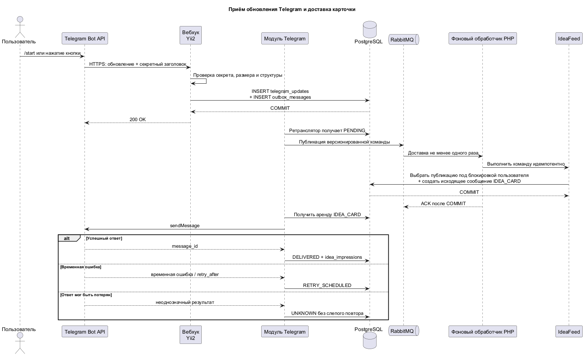
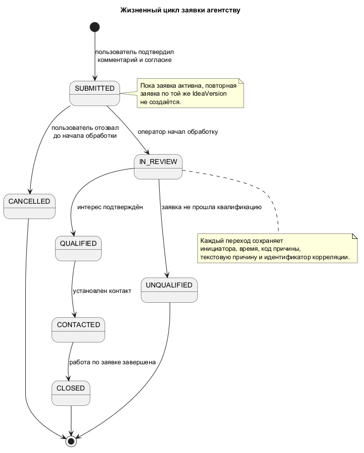

# Пользовательские сценарии IDEAKIT

> **Статус:** утверждённые пользовательские сценарии MVP. Документ описывает целевое поведение системы.

## 1. Участники

| Участник | Ответственность |
|---|---|
| Telegram-пользователь | Просматривает идеи, открывает отчёты, запрашивает PDF и создаёт заявку |
| Telegram Bot API | Доставляет входящие обновления и исходящие сообщения |
| Модуль Telegram в Yii2 | Проверяет входные транспортные данные, вызывает прикладные команды и формирует сообщения |
| Бизнес-модули | Выполняют правила пользователей, каталога, выдачи, заявок и уведомлений |
| Фоновый обработчик PHP | Обрабатывает надёжно сохранённые команды RabbitMQ |
| Контент-менеджер | Управляет идеями, источниками, проверками и повторными запусками |
| Оператор агентства | Квалифицирует заявки и ведёт переписку |
| Суперадминистратор | Управляет администраторами, ролями и настройками безопасности |

## 2. Общие правила

- Одно обновление Telegram обрабатывается не более одного раза по ключу `(bot_key, update_id)`.
- Данные кнопки (`callback`) содержат версию и подпись; пользователь не может подменить идентификатор или действие.
- Показ идеи фиксируется только после подтверждённой доставки Telegram либо нажатия кнопки на полученной карточке.
- Повторное нажатие одной кнопки не создаёт второй бизнес-эффект.
- Идея выбирается по общей последовательности `sequence_no` с учётом истории пользователя.
- Снятая с публикации идея не открывает новые детали, PDF и заявки.
- Внешняя ошибка не теряет уже зафиксированное намерение; временные ошибки повторяются ограниченно.
- Пользовательские сообщения и профиль не передаются провайдерам ИИ и поиска.

## 3. Техническая обработка Telegram

Исходник диаграммы: [`telegram-main-flow.puml`](../.diagrams/telegram-main-flow.puml).

## 4. Первый запуск

| Параметр | Описание |
|---|---|
| Предусловия | Пользователь доступен боту; обновление Telegram прошло проверку подлинности |
| Триггер | Команда `/start` |
| Сообщение | Короткое приветствие с объяснением трёх основных кнопок |
| Кнопки | «Следующая идея», «Детали», «Заказать у нас» |
| Изменения данных | Создание или обновление пользователя и сессии; сохранение обновления; подготовка доставки первой карточки |
| Итог | Пользователь получает первую ещё не показанную опубликованную идею |

Основной сценарий:

1. Обработчик вебхука проверяет секретный заголовок, размер и структуру обновления.
2. Update и команда фоновой обработки фиксируются одной транзакцией.
3. Telegram получает `200 OK` после фиксации транзакции.
4. Фоновый обработчик создаёт или обновляет пользователя со статусом `ACTIVE`.
5. `IdeaFeed` выбирает первую доступную публикацию.
6. Бот отправляет приветствие и карточку.
7. После подтверждения доставки создаётся показ.

Альтернативы:

- повторный `/start` не создаёт второго пользователя и продолжает последовательность;
- после разблокировки новый `/start` переводит `BOT_BLOCKED → ACTIVE`;
- если каталог исчерпан, выполняется сценарий раздела 6.

## 5. Следующая идея

| Параметр | Описание |
|---|---|
| Предусловия | Текущая карточка доставлена или подтверждена нажатием кнопки; идея опубликована |
| Триггер | Нажатие «Следующая идея» |
| Изменения данных | `NEXT_REQUESTED`, одна активная доставка следующей карточки, затем подтверждённый показ |
| Итог | Новая карточка отправлена отдельным Telegram-сообщением |

Основной сценарий:

1. Бот быстро подтверждает нажатие кнопки.
2. Под блокировкой пользователя проверяется отсутствие активной доставки карточки.
3. Выбирается минимальный доступный `sequence_no`.
4. Создаются действие и идемпотентное исходящее сообщение.
5. У старой карточки удаляется только кнопка «Следующая идея».
6. После успешной доставки создаётся `idea_impressions`.

Повторное нажатие той же кнопки возвращает результат уже созданной операции и не выбирает другую идею.

Ошибки доставки:

- временная ошибка — ограниченное число повторных попыток с учётом Telegram `retry_after`;
- постоянная ошибка — доставка `FAILED`, показ не создаётся;
- потерянный ответ — доставка `UNKNOWN`, автоматический слепой повтор запрещён;
- нажатие кнопки на карточке в состоянии `UNKNOWN` ретроактивно подтверждает показ;
- новый `/start` без такого подтверждения снова предлагает ту же редакцию, а не следующую.

## 6. Каталог исчерпан

1. Под блокировкой пользователя система убеждается, что следующей публикации нет.
2. Фиксируется номер, до которого каталог был просмотрен.
3. Бот сообщает: «Вы посмотрели все доступные идеи. Мы сообщим, когда появятся новые».
4. После новой публикации фоновая задача создаёт не более одного уведомления на пользователя.
5. Уведомление возвращает пользователя к обычной последовательности.

Повторные запуски до появления новых идей не создают дублирующие уведомления.

## 7. Детали

| Параметр | Описание |
|---|---|
| Предусловия | Редакция идеи опубликована и имеет готовый отчёт |
| Триггер | Нажатие «Детали» |
| Изменения данных | `DETAILS_OPENED`; исходящие сообщения разделов отчёта |
| Итог | Пользователь получает полный отчёт без ожидания провайдера ИИ |

Отчёт разделяется только по заранее определённым секциям. Порядок и состав частей при повторном запросе одинаковы. URL источников не включаются в сообщения.

Если публикация снята, бот сообщает, что материал недоступен. Новая генерация не запускается.

## 8. PDF

1. Пользователь выбирает экспорт в PDF из деталей.
2. Фиксируется `PDF_REQUESTED`.
3. Если готовый актуальный файл существует, бот отправляет его.
4. Если файла нет, создаётся одна идемпотентная фоновая операция.
5. Пользователь получает сообщение о подготовке.
6. После успешной генерации бот отправляет файл.

PDF связан с конкретной `IdeaVersion`, не содержит URL источников и может быть регенерирован после истечения срока хранения.

При ошибке бот отправляет безопасное сообщение и позволяет повторить запрос. Одновременные запросы не создают несколько файлов.

## 9. Создание заявки

| Параметр | Описание |
|---|---|
| Предусловия | Идея опубликована; активной заявки пользователя по этой редакции нет |
| Триггер | Нажатие «Заказать у нас» |
| Собираемые данные | Telegram-профиль, выбранная редакция идеи, свободный комментарий, версия согласия и время подтверждения |
| Итог | После подтверждения создана заявка `SUBMITTED` |

Основной сценарий:

1. Бот запрашивает комментарий.
2. Комментарий временно хранится в сессии диалога.
3. Бот показывает итоговый комментарий, текст согласия, кнопки подтверждения и отмены.
4. Пользователь подтверждает.
5. Под блокировкой сессии проверяются публикация, согласие и отсутствие активной заявки.
6. Одной транзакцией создаются заявка, первая запись истории и подтверждение для пользователя.
7. Черновик сессии очищается.
8. Бот сообщает: «Заявка принята».

Отмена до подтверждения очищает черновик и не создаёт заявку.

## 10. Повторная заявка

Если по той же `IdeaVersion` существует заявка в `SUBMITTED`, `IN_REVIEW`, `QUALIFIED` или `CONTACTED`, новая не создаётся. Бот показывает текущий статус и предлагает добавить сообщение в существующую переписку.

После `UNQUALIFIED`, `CLOSED` или `CANCELLED` пользователь может создать новую заявку.

## 11. Отзыв заявки

Пользователь может отозвать только заявку `SUBMITTED`, если обработка агентством ещё не началась.

1. Пользователь нажимает «Отозвать заявку».
2. Бот запрашивает подтверждение.
3. При подтверждении заявка блокируется и повторно проверяется.
4. Выполняется переход `SUBMITTED → CANCELLED`.
5. Сохраняются инициатор, причина, время и идентификатор корреляции.

Если оператор уже начал обработку, отзыв отклоняется, а пользователь получает текущий статус.

## 12. Обработка и переписка по заявке

Исходник диаграммы: [`agency-lead-state.puml`](../.diagrams/agency-lead-state.puml).

Оператор:

1. открывает заявку в административном портале;
2. видит связанную идею и разрешённые данные пользователя;
3. выполняет допустимый переход статуса с обязательной причиной;
4. при необходимости отправляет сообщение;
5. бот доставляет сообщение пользователю через надёжно сохранённое исходящее сообщение.

Пользователь нажимает «Ответить», вводит сообщение и подтверждает отправку. Сообщение добавляется только в переписку выбранной заявки.

Каждый переход статуса сохраняется в неизменяемой истории. Недопустимый переход, недостаточная роль или конфликт версии отклоняются без изменения данных.

## 13. Блокировка и разблокировка бота

После подтверждённой Telegram-ошибки блокировки пользователь получает статус `BOT_BLOCKED`:

- инициативные уведомления прекращаются;
- история, показы и заявки сохраняются;
- ожидающие инициативные доставки подавляются или завершаются безопасным статусом.

После нового подлинного `/start` статус возвращается в `ACTIVE`. Обезличенный пользователь автоматически не восстанавливается.

## 14. Снятая с публикации идея

Для снятой идеи:

- «Детали», новый PDF и «Заказать у нас» недоступны;
- бот показывает безопасное сообщение о недоступности;
- ранее созданная заявка и её переписка сохраняются;
- старые карточки в истории Telegram физически не удаляются.

Снятие публикации требует подтверждения администратора, причины и аудита.

## 15. Недоступность ИИ или источников

Недоступность провайдера ИИ или поиска не влияет на просмотр уже опубликованных идей, готовых отчётов, PDF и работу с заявками.

Фоновое задание получает повторяемую или терминальную ошибку. После исчерпания попыток материал становится доступен контент-менеджеру для разбора и не публикуется автоматически.

Недоступность уже использованного источника создаёт предупреждение `OPEN`. Контент-менеджер может перевести его в `ACKNOWLEDGED`; успешная последующая проверка переводит в `RESOLVED`. Идея автоматически не снимается с публикации.

## 16. Обезличивание пользователя

1. Пользователь отправляет запрос через бота.
2. Бот показывает последствия и запрашивает подтверждение.
3. После подтверждения уполномоченный администратор запускает обезличивание.
4. Удаляются внешний Telegram ID, профиль, сессии, транспортные идентификаторы и персональные тексты.
5. Внутренние UUID и минимальные технические связи сохраняются.
6. Сохраняются инициатор, причина, время и идентификатор корреляции операции.

Состояние `ANONYMIZED` терминальное.

## 17. Административные сценарии

### Контент-менеджер

- просматривает идеи, редакции, отчёты, источники и проверки;
- исправляет черновые данные через создание новой редакции;
- вручную запускает или повторяет фоновое задание с обязательной причиной;
- просматривает и подтверждает предупреждения источников;
- снимает публикацию только с подтверждением и причиной.

### Оператор агентства

- просматривает заявки и связанную идею;
- меняет статус только по разрешённому конечному автомату;
- отправляет сообщения в переписку заявки;
- не получает доступ к управлению контентом и администраторами.

### Суперадминистратор

- управляет администраторами и ролями;
- выполняет сброс MFA другого администратора с обязательной причиной;
- не может оставить систему менее чем с двумя активными `SUPER_ADMIN`.

### Наблюдатель

- видит каталог и агрегированную аналитику только для чтения;
- не видит комментарии и переписку заявок;
- не выполняет изменения.

## 18. Общие ошибки

| Ситуация | Поведение |
|---|---|
| Повторное обновление или нажатие кнопки | Возвращается прежний результат без повторного эффекта |
| Неизвестная версия данных кнопки или сообщения | Операция отклоняется безопасным машинным кодом |
| Неверная подпись или секрет | Запрос отклоняется без раскрытия деталей |
| Недоступна PostgreSQL | Вебхук не подтверждает надёжную фиксацию; бизнес-эффект не считается выполненным |
| Недоступен RabbitMQ | Команда остаётся в `outbox_messages` до восстановления |
| Недоступен Redis | Бизнес-данные не теряются; операция использует предусмотренный PostgreSQL-путь либо временно закрывается |
| Ошибка Telegram | Ограниченные повторные попытки, `FAILED` или `UNKNOWN` в зависимости от результата |
| Конкурентное изменение | Операция повторно читает состояние или возвращает безопасный ответ о конфликте |
| Нарушен конечный автомат бизнес-состояний | Изменения не фиксируются; пользователь получает допустимое сообщение |

Пользовательские ошибки не содержат трассировку стека, SQL, внутренние сведения провайдера, секреты или персональные данные.
